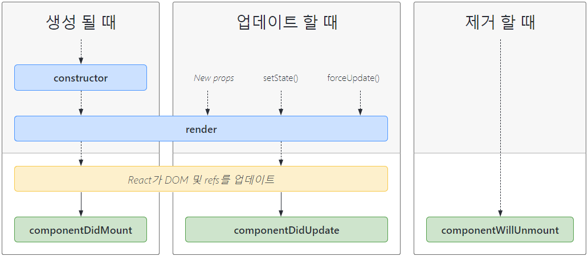

# Life Cycle(생명주기)

리액트 컴포넌트는 'Life Cycle'이라고 불리는 생명주기를 갖는다. 생명주기란 각 컴포넌트의 '생성(Mount) - 업데이트(Update) - 제거(Unmount)' 단계를 의미한다.

## 1. 클래스형 컴포넌트에서 생명주기

클래스형 컴포넌트는 `constuctor`, `componentDidMount`, `componentDidUpdate`, `componentWillUnmount`, `render` 등의 메서드를 사용하여 세 가지 단계를 조작할 수 있다.



다음은 클래스형 컴포넌트에서 생명주기를 다룬 예제이다.

```js
import React from "react";

export default class Clock extends React.Component {
  // 컴포넌트가 '생성될 때', 즉 React 엘리먼트를 생성하고 초기 상태를 설정하는 단계에서 호출되는 메서드이다.
  constructor(props) {
    // super()는 React.Component 클래스의 생성자를 호출한다.
    super(props);
    this.state = { date: new Date() };
  }

  // 새로운 Date값을 date에 할당하는 tick() 함수를 정의한다.
  tick() {
    this.setState({
      date: new Date(),
    });
  }

  // 컴포넌트가 '마운트된 후', 즉 React 엘리먼트가 브라우저 DOM에 마운트된 직후에 호출되는 메서드이다.
  componentDidMount() {
    // Mount시, 즉 생성 단계에 setInterval 함수를 한번만 실행하도록 설정한다.
    // setInterval 함수는 한번만 실행하면, 1초마다 tick함수를 실행하여 새로운 Date값을 가져와 state의 date에 할당한다.
    console.log("componentDidMount");
    this.timerID = setInterval(() => this.tick(), 1000);
  }

  // 컴포넌트가 '업데이트된 후' 호출되는 메서드이다.
  componentDidUpdate() {
    console.log("componentDidUpdate");
    console.log(this.state.date);
  }

  // 컴포넌트가 '언마운트된 후' 호출되는 메서드이다.
  componentWillUnmount() {
    console.log("componentWillUnmount");
    clearInterval(this.timerID);
  }

  render() {
    // 첫 렌더링을 정의한다.
    return (
      <div>
        <h1>Hello, world!</h1>
        <h2>It is {this.state.date.toLocaleTimeString()}.</h2>
      </div>
    );
  }
}
```

## 함수형 컴포넌트에서 생명주기

함수형 컴포넌트에서는 `useEffect`라는 Hook을 사용하여 클래스형 컴포넌트의 여러 생명주기 메서드를 대체할 수 있다.

`useEffect`는 두 가지 인자를 가지는데 첫 번째 인자는 '함수'이다. 두 번째 인자는 '배열'이고 이는 '의존성 배열(Array dependencies)'라고 불리며 선택적으로 사용 가능한 인자이다.

의존성 배열 없이 사용한 `useEffect`는 `componentDidMount`와 `componentDidUpdate`를 합친 것처럼 동작한다. 즉 Mount, Update 시 모두 동작하므로, "렌더링"될 때의 동작을 정의할 수 있다.

의존성 배열과 함께 사용한 `useEffect`는 '빈 의존성 배열을 사용했을 경우'에는 클래스형 컴포넌트의 `componentDidMount`처럼 동작하는데, 의존성 배열에 '특정값을 넣어준 경우' 입력한 특정값이 변경되었을 때만 `componentDidUpdate`처럼 동작하게 된다.

한편, `useEffect`에 첫 번째 인자인 함수에서 함수를 리턴하면 `componentWillUnmount`처럼 동작하게 된다.

다음은 위 클래스형 컴포넌트 예제를 함수형 컴포넌트로 수정한 예제이다.

```js
import React, { useState, useEffect } from "react";

export default function FunctionClock() {
  const [date, setDate] = useState(new Date());

  function tick() {
    setDate(new Date());
  }

  // Mount 시 동작을 정의한다.
  useEffect(() => {
    console.log("componentDidMount(Function)");
    const timerID = setInterval(tick, 1000);

    // Unmount 시 동작을 정의한다.
    // 어떤 useEffect에 들어가더라도 상관은 없지만, setInterval과 붙어있는 것이 가독성에 유리하기 때문에 이쪽에 작성 !
    return () => {
      console.log("componentWillUnmount(Function)");
      clearInterval(timerID);
    };
  }, []);

  // Update 시 동작을 정의한다.
  useEffect(() => {
    console.log("conponentDidUpdate(Function)");
    console.log(date);
  }, [date]);

  return (
    <div>
      <h1>Hello, world!</h1>
      <h2>It is {date.toLocaleTimeString()}.</h2>
    </div>
  );
}
```
